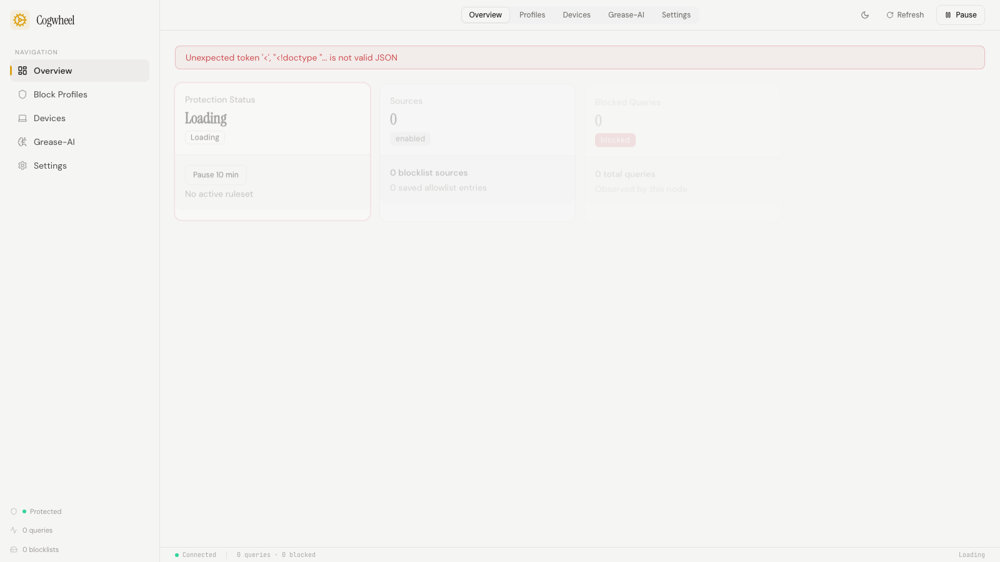

Cogwheel is a lightweight, Rust-powered DNS adblock platform that replaces Pi-hole with a safer, faster alternative built for modern home networks.

## Screenshots

## How it works

Cogwheel runs a full DNS resolver written in Rust that intercepts queries before they leave your network. When a device asks for a domain that appears on any active blocklist, the resolver returns a null response instantly — no tracker or ad server is ever contacted. The hot path is deterministic and never blocks on ML inference.

Blocklist updates are staged in a candidate pipeline and atomically promoted only after verification passes. If a new ruleset degrades runtime health, the control plane automatically rolls back to the last known-good policy set. This means household DNS never breaks because of a bad upstream list update.

The web control plane gives every household member a calm, readable dashboard. Block profiles let you assign different filtering levels per device — a child's tablet gets strict protection while a work laptop keeps developer tools accessible. The Grease-AI classifier monitors DNS traffic patterns in the background and flags risky domains without touching the hot path.

Multi-node sync, Tailscale exit-node integration, and webhook-based security alerts round out the platform for users who run Cogwheel across multiple sites.

## Stack

- **Rust** — Axum HTTP server, Hickory DNS resolver, Moka cache, SQLite via rusqlite
- **React 19** — Vite, TypeScript, ShadCN/UI, Tailwind CSS
- **Docker** — Single-container deployment with environment-based config
- **Prometheus** — Metrics endpoint for observability

## Status

In progress
